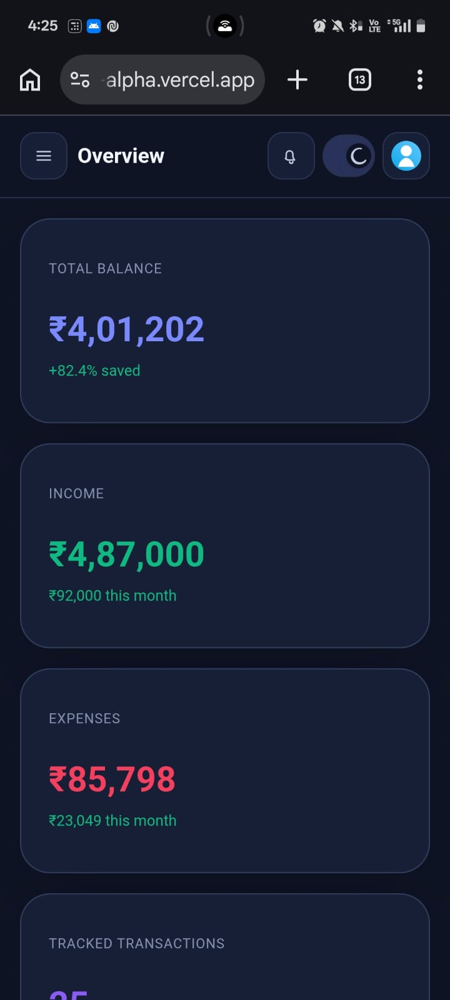

# FinDash

A responsive finance dashboard UI built with React and Vite that focuses on presenting financial activity clearly through summary cards, charts, insights, and a transaction management view.

## Live Demo

https://financial-dashboard-chi-plum.vercel.app

## Project Overview

This project simulates a simple personal finance dashboard where users can:

- view an overall financial summary
- explore transactions with search, filters, and sorting
- understand monthly cashflow and spending patterns
- switch between `Viewer` and `Admin` roles on the frontend
- use a dark/light theme toggle

## Screenshots

### Dashboard Overview


### Transactions View


### Mobile View
<p>
  
  
  
  
</p>

## Approach

- `App.jsx` manages layout, role, theme, and navigation
- `useTransactions.js` handles state + local storage
- `Dashboard.jsx` computes insights
- Charts are modular components
- Transactions logic is isolated

## Features

### Dashboard Overview
- Summary cards
- Cashflow chart
- Expense pie chart

### Transactions
- Search, filter, sort
- CRUD (Admin only)

### Role-Based UI
- Viewer → read-only
- Admin → full access

### Insights
- Highest spend category
- Monthly trends
- Avg category spend

### UI/UX
- Responsive design
- Dark/light mode
- Animations

## Tech Stack

- React
- Vite
- JavaScript (JSX)
- CSS

## Folder Structure

```text
src/
  assets/
  components/
  data/
  hooks/
  pages/
  utils/
```
## Setup Instructions

```git clone https://github.com/Sanst150505/Financial-dashboard.git
cd Financial-dashboard
npm install
npm run dev
npm run build
```

## Possible Improvements

- Add backend (API persistence)
- Export CSV/JSON
- Advanced analytics
- Toast notifications
- Unit testing
