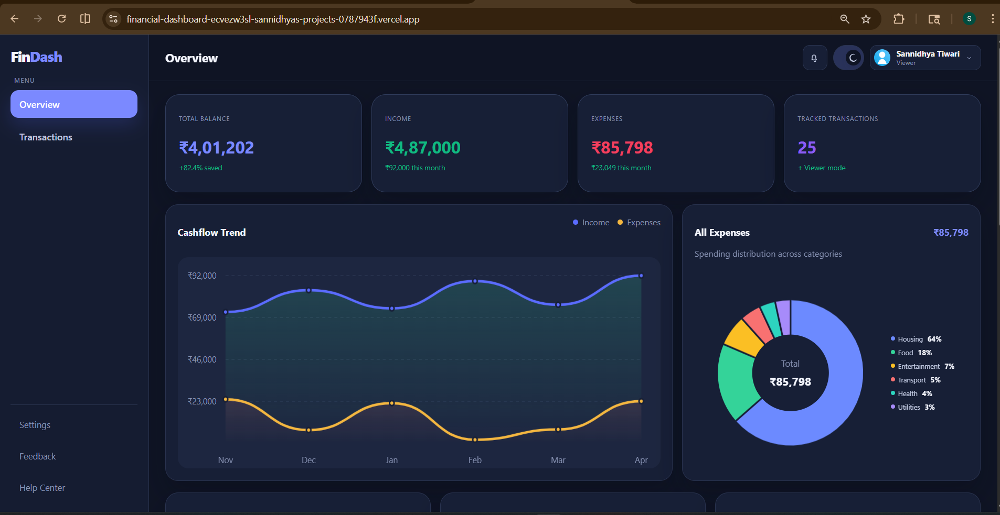
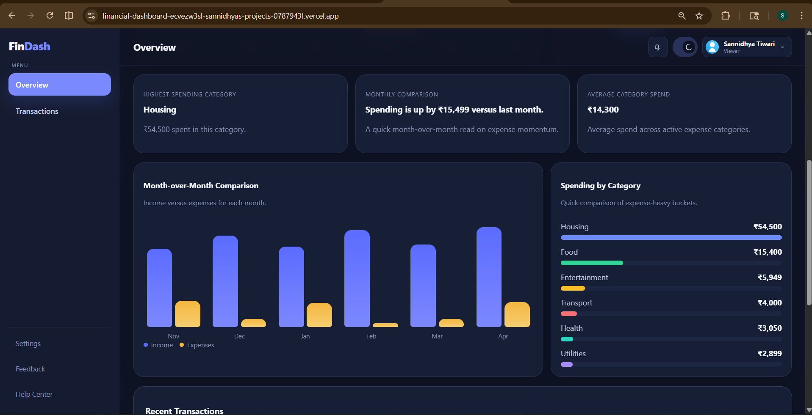
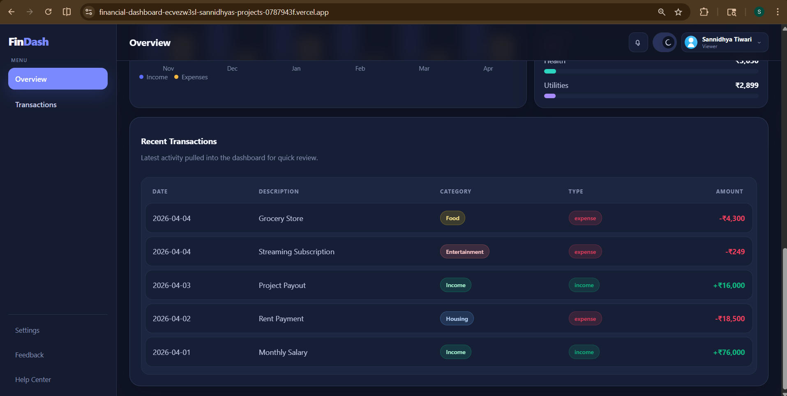
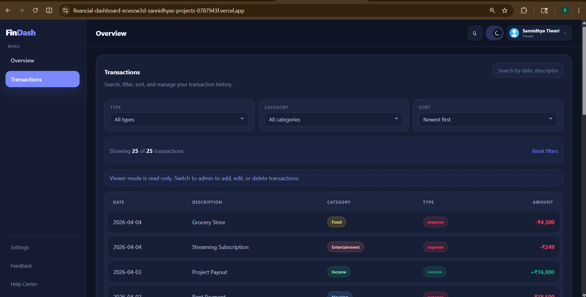
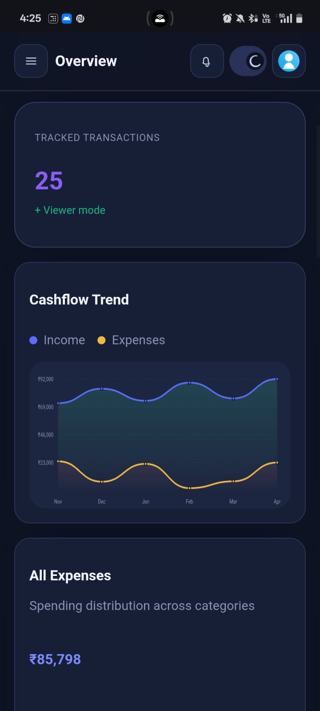
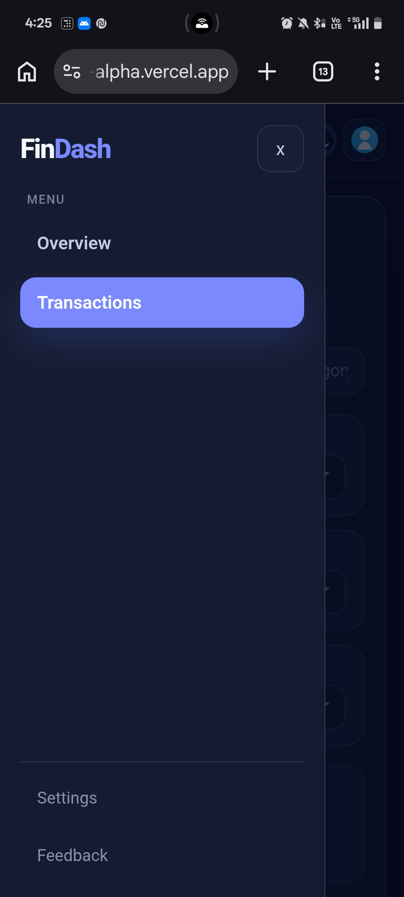
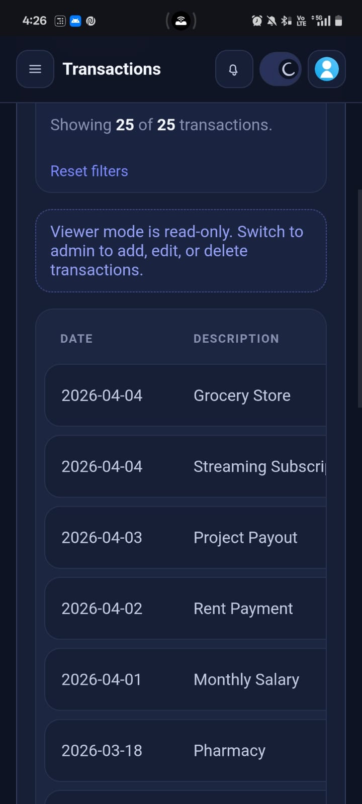
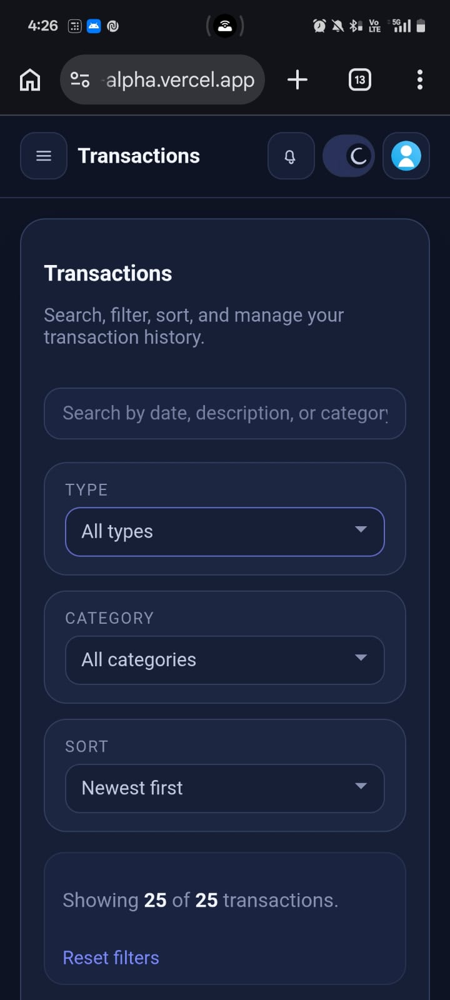

# FinDash

A responsive finance dashboard UI built with React and Vite for the internship assignment. The application focuses on presenting financial activity clearly through summary cards, charts, insights, and a transaction management view, while keeping the implementation frontend-only and easy to follow.

## Live Demo

https://financial-dashboard-chi-plum.vercel.app

## Project Overview

This project simulates a simple personal finance dashboard where users can:

- view an overall financial summary
- explore transactions with search, filters, and sorting
- understand monthly cashflow and spending patterns
- switch between `Viewer` and `Admin` roles on the frontend
- use a dark/light theme toggle

The app is intentionally built with mock data and local state because the assignment does not require backend integration. The goal was to create a polished, intuitive, and responsive interface that demonstrates frontend thinking, component structure, and attention to UI detail.

## Screenshots

### Dashboard Overview




### Transactions View


### Mobile View






## Approach

The dashboard was built with a component-based React structure and a simple, well-scoped state management approach.

- `App.jsx` manages the shell layout, active page, selected role, theme, and shared transaction actions.
- `useTransactions.js` handles transaction state and local storage persistence.
- `Dashboard.jsx` computes derived values such as total balance, expense categories, recent activity, and monthly insights from transaction data.
- Charts are split into dedicated components under `src/components/Charts/` for better readability and modularity.
- The transactions section is organized separately so filtering, sorting, searching, and CRUD UI remain isolated from the dashboard summary view.

This keeps the code straightforward for a frontend assignment while still being scalable enough for future additions like API integration or export features.

## Features

### 1. Dashboard Overview

- Summary cards for total balance, income, expenses, and tracked transactions
- Time-based cashflow trend chart
- Category-based expense pie chart
- Additional monthly comparison and category spend visualizations

### 2. Transactions Section

- Transaction list with:
  - date
  - description
  - category
  - type
  - amount
- Search by date, description, or category
- Filter by type and category
- Sort by newest, oldest, highest amount, lowest amount, or category

### 3. Role-Based UI

- `Viewer` mode is read-only
- `Admin` mode can add, edit, and delete transactions
- Role can be switched from the profile dropdown for demo purposes

### 4. Insights Section

- Highest spending category
- Month-over-month spending observation
- Average category spend

### 5. State Management

- React state for UI interactions
- Custom hook for transaction management
- Local storage persistence for transactions and theme preference

### 6. UI and UX

- Responsive layout for desktop, tablet, and mobile
- Sidebar drawer on smaller screens
- Dark and light theme support
- Empty states and read-only hints
- Subtle chart and interface animations

## Design Decisions

A few intentional choices shaped this project:

- I used mock data and frontend-only role switching because the assignment did not require backend integration.
- I focused on clarity, responsiveness, and UI polish instead of adding unnecessary complexity.
- I split major UI sections into reusable components so the code stays easier to maintain and explain.
- I used custom chart components to keep the design aligned with the rest of the interface and avoid unnecessary dependency overhead.

## Tradeoffs

To keep the project focused and aligned with the assignment scope:

- Role-based access is simulated on the frontend only.
- Data is persisted using local storage instead of a backend.
- Some navigation items are lightweight placeholders for UI completeness rather than fully implemented pages.

## Tech Stack

- React
- Vite
- JavaScript (JSX)
- CSS

## Folder Structure

```text
src/
  assets/
  components/
    Charts/
    Common/
    Dashboard/
    Transactions/
  data/
  hooks/
  pages/
  utils/
  App.jsx
  main.jsx
  index.css
```

## Setup Instructions

### 1. Clone the repository

```bash
git clone https://github.com/Sanst150505/Financial_dashboard.git
cd Financial_dashboard
```

### 2. Install dependencies

```bash
npm install
```

### 3. Start the development server

```bash
npm run dev
```

### 4. Build for production

```bash
npm run build
```

## Notes and Assumptions

- The project uses mock financial data and frontend-only role switching.
- Currency formatting is adapted for Indian Rupees (`INR`).
- The interface is designed as an assignment/demo project, not a production financial product.

## Possible Improvements

Given more time, I would extend this project with:

- API-backed transaction persistence
- Export to CSV or JSON
- More advanced analytics and grouping
- Inline notifications/toasts for user actions
- Unit tests for filters, calculations, and transaction flows

## Why This Meets the Assignment

This submission covers the required dashboard overview, transaction exploration, role-based UI behavior, insights, state management, responsiveness, and documentation. It also includes optional enhancements such as theme support, local storage persistence, and transitions for a more polished experience.
